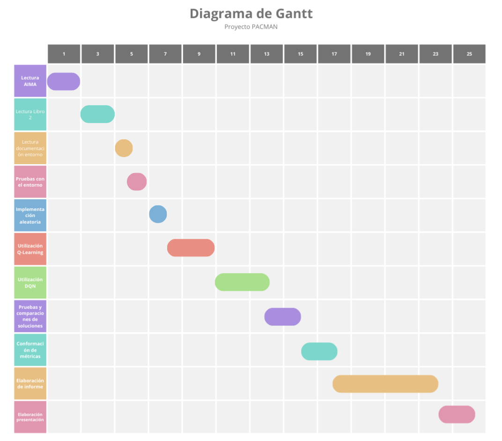

# **Anteproyecto final \- IA**

# **Pacman con Reinforcement Learning**

### **Código del proyecto:** PACMAN  

#### **Integrantes:** Paulina Suden y Tomás Rando

#### **Descripción:**

El proyecto consistirá en resolver Pacman utilizando Reinforcement Learning. Pacman es un videojuego del año 1980 el cual consiste en un personaje que se mueve en un entorno donde hay 4 fantasmas, el objetivo es lograr “comer” todos los puntos posibles. Para lograrlo, existen puntos más grandes que le dan a Pacman la posibilidad de comerse a los fantasmas, lo que le brinda tiempo vivo y puntos extra. Además, existen frutas que pueden aparecer y le brindan a Pacman puntos adicionales si son consumidas. 

**Objetivo del proyecto:**  

Por ello, el objetivo del proyecto es utilizar diversos algoritmos del área de Reinforcement Learning para intentar lograr que el agente aprenda a jugar lo mejor posible. El alcance del proyecto estaría limitado a aplicar ciertos algoritmos para comparar las diversas métricas entre sí, estos podrían ser la solución aleatoria, Q-Learning, DQN (Deep Q Network), y, de tener tiempo de sobra, se intentaría abordar una solución mediante PPO (Proximal Policy Optimization).  

**Métricas:**  

Pacman tiene dos objetivos principales: Conseguir la mayor cantidad de puntos y ganar la partida. Por ello, es posible comparar las soluciones con diversas métricas, dependiendo de nuestro objetivo. Primero, se puede observar si ganó la partida o no, junto a la cantidad de veces que lo logró en una determinada cantidad de ejecuciones. Otra métrica a considerar es el tiempo que el agente permaneció vivo en la partida. Además, es posible medir y comparar la puntuación obtenida durante la partida. Por último, se podría crear una métrica general a partir de todas las anteriores, es decir, que tome en cuenta la cantidad de tiempo vivo, la puntuación realizada y si ganó la partida.

Para la realización del proyecto se buscaron entornos con los que se pudiera replicar el juego y obtener información para poder aplicar los algoritmos de reinforcement learning, por ello, se encontraron dos posibles opciones: Pacman o MsPacman de Atari de Gymnasium o Berkeley Pacman. Ambas, se encuentran en la sección de referencias. Además, para la utilización de los algoritmos, una de las opciones encontradas es la librería “Stable Baselines3” para Python.

#### Justificación:  

Aplicar Reinforcement Learning con Pacman trae muchas ventajas, ya que, al aprender basándose en recompensas, permite adaptarse para maximizar dicha recompensa. Además, con este enfoque es posible la adaptación en tiempo real al entorno del juego. Otra ventaja es que sería posible la generalización de conocimientos para poder adaptarse a nuevos entornos de pacman. Otro motivo es que la IA no necesita conocer de antemano el comportamiento de los fantasmas, por lo que es óptima la elección.

#### Listado de actividades a realizar:  

Lectura del capítulo 21 del AIMA \[2 días\]  
Lectura de "Hands-On Reinforcement Learning with Python" de Sudharsan Ravichandiran ((Posible)) \[2 días\]  
Lectura de la documentación del entorno \[1 día\]  
Pruebas con el entorno \[1 día\]  
Implementación de la solución aleatoria \[1 día\]  
Utilización de Q-Learning para formar una solución \[3 días\]  
Utilización de DQN para formar una solución \[3 días\]  
Pruebas y comparaciones de las soluciones encontradas \[2 días\]  
Recopilación y conformación de métricas para su posterior graficación \[2 días\]  
Elaboración del informe \[6 días\]  
Elaboración de la presentación \[2 días\]  

#### Cronograma estimado de actividades (gantt):

#### Referencias.

1. [https://stable-baselines3.readthedocs.io/en/master/](https://stable-baselines3.readthedocs.io/en/master/)  
2. [https://ai.berkeley.edu/project\_overview.html](https://ai.berkeley.edu/project_overview.html)  
3. [https://ale.farama.org/environments/pacman/](https://ale.farama.org/environments/pacman/)  
4. [https://cs229.stanford.edu/proj2017/final-reports/5241109.pdf](https://cs229.stanford.edu/proj2017/final-reports/5241109.pdf)  
5. [https://upcommons.upc.edu/bitstream/handle/2099.1/26448/108745.pdf?sequence=1](https://upcommons.upc.edu/bitstream/handle/2099.1/26448/108745.pdf?sequence=1)  
6. [https://es.wikipedia.org/wiki/Pac-Man](https://es.wikipedia.org/wiki/Pac-Man)
