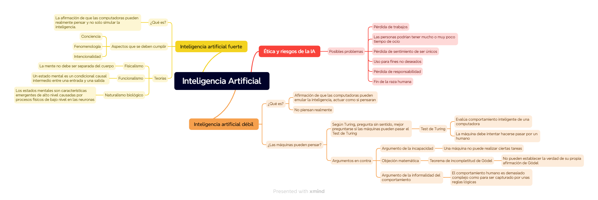

# Trabajo práctico 1 - Inteligencia artificial

## Ejercicio 1.
## a.
### Inteligencia Artificial débil
La inteligencia artificial débil es la afirmación de que las computadoras pueden emular la inteligencia, es decir, actuar como si pensaran. Las primeras ideas de esto vinieron dadas por el pensamiento de que cualquier aspecto del aprendizaje o de la inteligencia puede ser tan precisamente descrita que una máquina puede simularlo. Mientras tanto, otros afirmaban que la IA débil no era posible.

Se puede definir la inteligencia artificial como la búsqueda del mejor programa agente en una arquitectura dada. Por ello, la IA es posible, ya que para una arquitectura digital dada con k bits de almacenamiento de programas hay 2^k programas agentes, por lo que para encontrar el mejor solo hay que enumerarlos y probarlos a todos. Entonces, esto nos lleva a la pregunta, ¿Las computadoras pueden pensar?.

Según Turing, esta pregunta es fútil y nos menciona que sería mejor preguntar si las computadoras pueden pasar una prueba de inteligencia conductual, es decir, el llamado "Turing Test" o "Prueba de Turing". Él mencionó que para el año 2000, una computadora decente podría pasar la prueba, pero estuvo en lo incorrecto. Sin embargo, las personas si eran engañadas cuando no sabían que podrían haber estado hablando con una máquina. Algunos ejemplos de estos son: "Eliza", "Mgonz", "Natachata" y "CyberLover".

Con el tiempo, han existido argumentos en contra de la posibilidad de máquinas inteligentes. Uno de ellos es el **argumento de la incapacidad**, es decir, "Una máquina no podría hacer X cosa". Algunas de las cosas que lista Turing son: ser gentil, enamorarse, tener sentido del humor, entre otros. Sin embargo, algunas de las cosas que nombran ya han sido demostradas posibles, por ejemplo, ya ha habido casos en los que han hecho que humanos se enamoren de la tecnología. Cabe aclarar que las computadoras puedan hacer estas cosas no quiere decir que entiendan lo que están haciendo, pues esto no forma parte de su comportamiento.

Otro argumento en contra es el de **objeción matemática**. Algunos filósofos han afirmado que el teorema de incompletitud de Gödel muestra que las máquinas son mentalmente inferiores a los humanos porque los sistemas formales están limitados por el teorema, es decir, no pueden establecer la verdad de su propia oración de Gödel. Por otro lado, los humanos no tienen esa limitación. Han surgido algunos problemas con esta afirmación, por ejemplo, el argumento se basa en que las computadoras son máquinas de Turing, sin embargo, no es verdad, ya que las máquinas de Turing son infinitas, mientras que las computadoras no. Tomando otro ejemplo del mismo argumento, las personas no podrían hacer nunca una suma de números excesivamente grandes, mientras que las computadoras sí. El último contraargumento es que si las computadoras tienen limitaciones en lo que pueden probar, no hay evidencia de que los humanos sean inmunes a esas limitaciones.

El siguiente argumento que se nos presenta es el **argumento de la informalidad del comportamiento**. Básicamente nos menciona que el comportamiento del ser humano es demasiado complejo como para ser capturado por unas reglas que la computadora sigue. La inhabilidad de captar todo en reglas lógicas es llamado el problema de las aptitudes en IA. Dreyfus y Dreyfus proponen un proceso de 5 etapas para adquirir experiencia. Con ello, en vez de ser críticos de la IA, se convierten en teóricos de la IA. Ellos proponen una arquitectura de red neuronal organizada en una biblioteca de casos. Ha tenido algunos problemas que han sido identificados con el paso del tiempo: No se puede alcanzar una buena generalización a partir de ejemplos sin el conocimiento de los antecedentes; mencionan que no pueden operar de manera autónoma, es decir, sin la ayuda de un entrenador humano, sin embargo, se ha visto que esto si puede ser logrado; afirman que los algoritmos de aprendizaje no funcionan bien con muchas funciones y si seleccionamos un conjunto de estas, no hay manera conocida de agregar nuevas en caso de que el conjunto actual resulte inadecuado para los hechos aprendidos, sin embargo, nuevos métodos pueden manejar largas listas de funciones correctamente; afirman que no se entienden los detalles del mecanismo que utiliza el cerebro para dirigir sus sensores para buscar información relevante y procesarla, por lo que no se han formulado hipótesis que puedan guiar la investigación en la inteligencia artificial, pero, contradiciendo esto, han habido teorías que han sido puestas en práctica en robots. Uno de los argumentos más fuertes de Dreyfus es que un agente cuyo entendimiento de "perro" viene dado por un limitado conjunto de afirmaciones lógicas es una desventaja comparado con un agente que ha visto a los perros correr, ha jugado con ellos, ha sido lamido por uno, entre otras.

## Inteligencia Artificial fuerte
Por el contrario, la inteligencia artificial fuerte es la afirmación de que las computadoras pueden realmente pensar y no solo simular la inteligencia. Se habla de ciertos aspectos que la IA debería cumplir para poder afirmar que "piensa" por sí misma, estos son: la conciencia, es decir, la máquina debe tener conocimiento de su estado mental y sus acciones; fenomenología, la computadora debe sentir emociones; intencionalidad, es decir, si los sentimientos, deseos o creencias de las máquinas son realmente de algo del mundo real. Turing mantenía que la pregunta de si las máquinas pueden pensar es extraña  y comenta que en vez de argumentar continuamente sobre esto, se debería tener una conversación sobre lo que cada persona piensa.

Hay muchas personas que han afirmado que el pensamiento artificial nunca será posible, John Searle argumentó que si una simulación de una tormenta en una computadora no moja, entonces no habría razones para creer que una simulación de procesos mentales tiene procesos mentales. Sin embargo, no se tiene muy claro que esta analogía sea la correcta para pensar acerca de los procesos mentales. Turing afirmó que la discusión se resolvería por sí sola cuando las computadoras alcanzaran un cierto nivel de sofisticación.

**Fisicalismo**
Existen ciertas teorías, como la teoría monista o fisicalismo, que sostiene que la mente no se debe separar del cuerpo, es decir, que los estados mentales son estados físicos. Esta teoría conduciría a la posibilidad de la inteligencia artificial fuerte.

Los filósofos fisicalistas han intentado explicar que significa que una persona o una computadora esté en un estado mental particular. Se han ocupado principalmente de los estados intencionales, estos son: creer, saber, desear, entre otros. Si el fisicalismo está en lo correcto debe ser correcto afirmar que un estado mental está determinado por el estado del cerebro de la persona. Es decir, el mismo estado mental no podría corresponderse con dos estados mentales distintos. Esto se contrarresta con el argumento de que un cerebro podría criarse artificialmente y podría ser estimulado con señales que simulen un mundo ficticio. Se podría simular una cierta actividad, ante lo cual el cerebro entraría en cierto estado que correspondería al estado mental de "saber que se está haciendo esa actividad", sin embargo, no se podría tener ese estado mental ya que en verdad no se está haciendo esa actividad. Esto se soluciona separando dos puntos de vista el amplio, es decir, el punto de vista de un observador omnisciente que puede ver la diferencia entre los mundos y el estrecho, el cual solo considera el estado del cerebro. En el caso de la inteligencia artificial, el estrecho sería el más apropiado, puesto que no tiene sentido preguntarnos si la inteligencia artificial puede pensar si tenemos en cuenta las condiciones fuera del sistema.

**Funcionalismo**
La teoría del funcionalismo nos dice que un estado mental es un condicional causal intermedio entre una entrada y una salida. Se menciona que dos sistemas con procesos causales isomórficos tendrían los mismos estados mentales. Entonces, una computadora podría tener los mismos estados mentales que una persona. Esto es más claro con el experimento de reemplazo de cerebro, en el que básicamente se reemplazan todas las neuronas con dispositivos electrónicos, ante lo cual el comportamiento externo del sujeto debería no ser afectado. Sin embargo, con respecto a la conciencia, algunos sostienen que la conciencia no sería afectada y otros que desaparecería.

Para ello, hay 3 posibles conclusiones:
- Los mecanismos causales de conciencia que generan las salidas en cerebros normales siguen operando en la versión electrónica, por lo que hay conciencia.
- Los eventos mentales conscientes en el cerebro normal no tienen conexión causal al comportamiento y no existen en el cerebro electrónico, por lo que no hay conciencia.
- El experimento es imposible, por lo tanto la especulación acerca de este carece de sentido.

**Naturalismo biológico**
John Searle sostuvo que los estados mentales son características emergentes de alto nivel que son causadas por procesos físicos de bajo nivel en las neuronas y son las propiedades físicas de las neuronas las que importan. Por ende, los estados mentales no pueden ser duplicados en base a un programa que tiene la misma estructura funcional con el mismo comportamiento entrada-salida. El argumento de Searle es que un sistema hipotético que está corriendo un programa y pasa el Test de Turing, no entiende nada de las salidas y entradas. La conclusión es que correr un programa apropiado no es condición suficiente para ser una mente (o generar entendimiento).

La afirmación realizada por Searle se basa en los siguientes cuatro axiomas:
- Los programas de computadora son formales
- Las mentes humanas tienen contenido mental
- La sintaxis por sí misma no es ni constitutiva ni suficiente para la semántica
- Los cerebros causan las mentes

De los primeros tres axiomas se concluye que los programas no son suficientes para las mentes. En otras palabras, un agente corriendo un programa podría ser una mente, pero no es necesariamente una por el solo hecho de estar corriendo el programa. Del cuarto axioma él concluye que cualquier otro sistema capaz de causar mentes tendría que tener poderes causales al menos equivalentes a los de los cerebros. Por ello, un cerebro artificial tendría que duplicar el poder causal de los cerebros, no solo correr un programa. Los axiomas presentados son controversiales, pero si se asume que son verdaderos, solo se muestra que si se niega el funcionalismo no se puede concluir necesariamente que los no-cerebros son mentes.
## La ética y los riesgos de desarrollar Inteligencia Artificial
En esta sección se aborda el tema de si deberíamos desarrollar IA o no. Es decir, si los efectos de hacerlo serían más positivos que negativos. Algunos de los problemas que podrían aparecer son:
- La gente podría perder sus trabajos a causa de la automatización
- Las personas podrían tener mucho o muy poco tiempo de ocio
- Las personas podrían perder el sentimiento de ser únicos
- Los sistemas de IA podrían ser usados para fines no deseados.
- El uso de IA podría resultar en una pérdida de responsabilidad
- El éxito de la IA podría significar el fin de la raza humana

**La gente podría perder sus trabajos a causa de la automatización**
La industria moderna es cada vez más dependiente de las computadoras en general. Además, muchas áreas ya son realizadas por programas de inteligencia artificial, por ejemplo detección de fraude, aplicaciones para tarjetas de crédito, aprobación de pagos, entre otros. El caso es que sin la IA, estos trabajos no existirían porque el costo de personal humano sería inaceptablemente alto. De hecho, hasta ahora la automatización y la IA ha creado más trabajos de los que ha eliminado y ha creado trabajos más interesantes y mejor pagados.

**Las personas podrían tener mucho o muy poco tiempo de ocio**
Las personas trabajando en industrias de conocimiento intensivo se han visto parte de un sistema computarizado que opera las 24 horas del día, para mantenerse al ritmo, se han visto obligadas a trabajar más horas. Además, trabajar más horas y ser mejor que la competencia conllevaría a un aumento en los ingresos, entonces, existe una presión por trabajar mejor. La inteligencia artificial promete brindar tiempo libre y permitir que los agentes automatizados hagan los trabajos por un rato. Tim Ferriss recomendó usar la automatización y buscar lograr una semana de trabajo de 4 horas.

**Las personas podrían perder el sentimiento de ser únicos**
Weizenbaum sostiene que la idea de la inteligencia artificial hace posible la idea de que los humanos son autómatas, es decir, una idea que resultaría en una pérdida de autonomía o de la humanidad. Sin embargo, esta no es la primera vez que ha surgido este pensamiento, y no solo con respecto a la IA, pero la humanidad ha sobrevivido a estos sucesos.

**Los sistemas de IA podrían ser usados para fines no deseados.**
Weizenbaum reconoce que la IA tiene el potencial masivo de producir vigilancia en masa. Su predicción en parte se ha vuelto verdadera, por ejemplo, en el Reino Unido, se tiene una extensa red de cámaras de vigilancia y otros sistemas de monitoreo. Además, otros autores sostienen que la pérdida de privacidad es inevitable, pero que la forma de combatir el poder asimétrico de un gobierno sobre sus individuos es hacer posible la vigilancia a todos sus ciudadanos.

**El uso de IA podría resultar en una pérdida de responsabilidad**
Depende el área en el que uno se maneje, por ejemplo, actualmente en la medicina, los sistemas expertos médicos son vistos como libros de referencia y es responsabilidad del médico juzgar las recomendaciones. Sin embargo, si en algún momento la IA se vuelve más precisa que los humanos, entonces el médico podría ser responsable al no seguir sus consejos. Además, en otros lugares, en áreas como los autos que se manejan solos, no hay sanciones para prevenir que exceda el límite de velocidad, sin embargo, el diseñador del mecanismo de control sería el responsable en caso de un accidente. En este apartado, la ley todavía debe ponerse al corriente con los nuevos desarrollos que van surgiendo.

**El éxito de la IA podría significar el fin de la raza humana**
Siempre la tecnología ha tenido el potencial de causar daño en las manos equivocadas, sin embargo, con la inteligencia artificial y la robótica, las manos equivocadas podrían ser de la misma robótica. La inteligencia artificial podría estimar incorrectamente un estado, causando que realice mal una acción, pudiendo ocasionar un grave accidente. La manera de mitigar estos riesgos es diseñar un sistema que chequee y balancee el sistema para que un solo estado mal estimado no se propague por todo el sistema no verificado. Otra posibilidad es que el sistema de aprendizaje de la IA cause que esta evolucione a comportamiento no intencionado, este escenario es único de cada inteligencia artificial.

Otro escenario posible es la existencia de máquinas ultrainteligentes (Máquinas capaces de sobrepasar la inteligencia humana, dejando a los seres humanos detrás). Si esto fuese posible, los humanos deberían diseñar a los predecesores con el fin de que se trate bien a los humanos. Este tema ha sido tratado con anterioridad, por ejemplo, Isaac Asimov, escritor de ciencia ficción, creó sus 3 leyes de la robótica.

Una idea que se tiene es la de tener un salvoconducto contra el cambio de funcionamiento de estas máquinas. Finalmente, debemos considerar el punto de vista del robot, si el robot se vuelve consciente, entonces no podríamos tratarlo como una simple máquina. Hay algunas películas que han tratado con este asunto, por ejemplo A.I. de Spielberg, la cual argumenta la necesidad de tener derechos civiles para los robots.

## b.

## c.
Personalmente, opino que la inteligencia artificial actual corresponde a la inteligencia artificial débil, ya que las computadoras no son capaces de pensar por sí mismas. Además, con la tecnología actual no considero que la IA fuerte sea posible. Es decir, basándose en el capítulo, no creo que sea posible replicar la conciencia o la inteligencia humana cuando ni siquiera tenemos un conocimiento pleno de su funcionamiento. Con respecto al último tema, ética y riesgos, considero que algunos de los problemas mencionados sí son reales. Por ejemplo, los trabajos relacionados a la traducción considero que sí están en peligro de desaparecer, creo que la IA está alcanzando un punto en el que se está volviendo muy eficiente y veloz para traducir textos, incluso hablados. Además, también estoy de acuerdo con que la IA puede ser utilizada para malos fines, sin embargo, considero que cualquier cosa puede ser utilizada de mala manera por la persona equivocada. Es decir, creo que no solo la inteligencia artificial puede ser peligrosa, por lo que intentaría limitar estos malos usos con regulaciones u otras limitaciones posibles. Por último, con respecto al fin de la raza humana gracias a la IA, no lo veo posible en un futuro cercano, al menos, no considero que esta tecnología esté tan desarrollada para siquiera pensar en este escenario.

## Ejercicio 3

En mi opinión, si bien se entienden algunos de los comentarios realizados en el artículo, considero que no son del todo objetivos. Creo que gran parte de los problemas que menciona, no son de la inteligencia artificial en sí, sino de las personas que no utilizan correctamente la herramienta. Es decir, las personas no verifican lo que la IA les comenta o, erróneamente, creen que todo lo que dice es cierto. Entonces, por ejemplo cuando menciona las teorías conspirativas que han sido generadas por la misma IA, considero que el error es de las personas por ver a la herramienta como una fuente de verdad y no como un modelo de lenguaje, no porque genere un texto mencionando que podría "Hackear cualquier sistema en internet y controlarlo" significa que sea verdad. Otro ejemplo de esto en la actualidad es la gran cantidad de noticias que salen a diario con títulos como: "Le pregunté a la IA quien va a ganar en las siguientes elecciones" y lo grave no es la noticia, si no que las mismas personas no se cuestionen la veracidad de la información o no tengan presente que la inteligencia artificial no es un ente superior que sabe el futuro, si no que es un modelo de lenguaje que genera texto basado en otras fuentes de información de las que ha sido alimentado con anterioridad.

Con respecto a esto último, en un momento critica las fuentes de información que fueron utilizadas para entrenar a ChatGPT. Personalmente, no estoy de acuerdo con esto, puesto que si bien es verdad que hay fuentes con mucha información "contaminada" con diversos discursos de odio, considero que tener presentes dichas fuentes, con un debido proceso de filtrado, es correcto debido a que esos lugares poseen también información muy valiosa que ha sido recopilada a lo largo de los años y no deberían desaprovecharse.

Un punto con el que sí estoy de acuerdo es con la analogía que realiza al principio de la redacción, es decir, la de las dos islas y el pulpo. Considero que actualmente la inteligencia artificial se basa en la información que ha recopilado y en patrones encontrados, pero que se podría quedar "corta" debido a no tener acceso al mundo real. Sin embargo, en la actualidad, hay tanta información en internet del  mundo real que creo que esto se está atenuando día tras día.

En resumen, considero que la inteligencia artificial generativa es una herramienta muy útil, siempre que se use teniendo presente sus capacidades reales y limitaciones. Por ello, creo que no se debería condenar una tecnología por el mal uso que le podría dar el humano.

