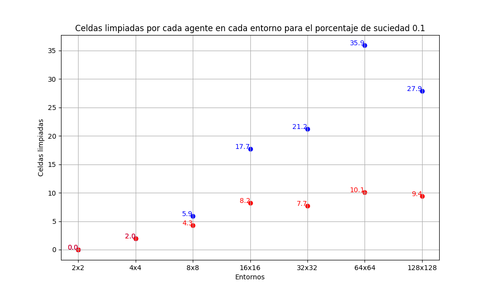
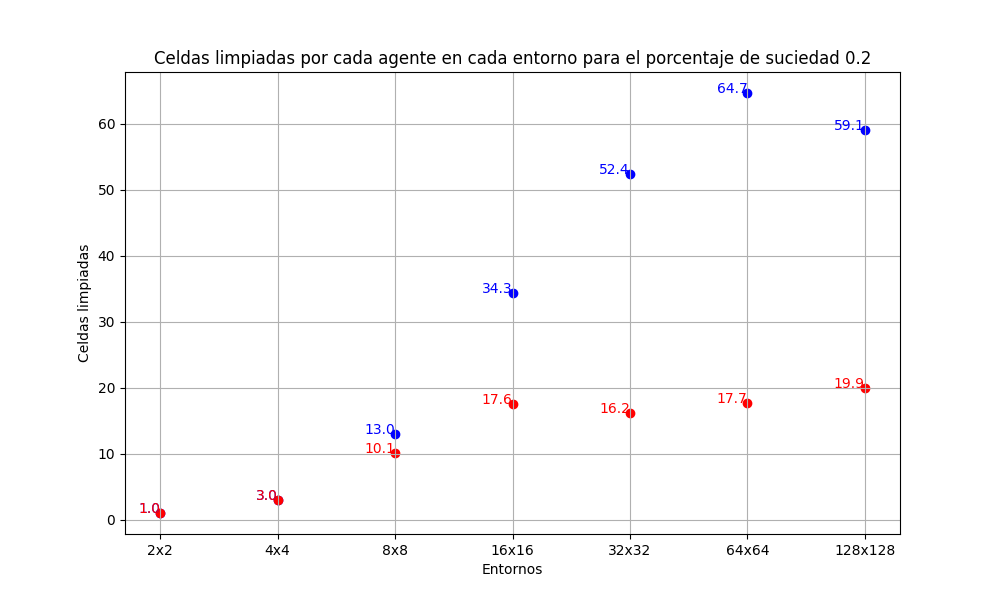
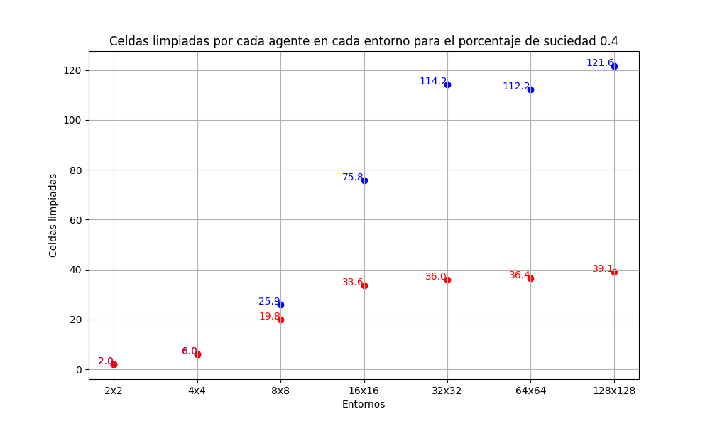
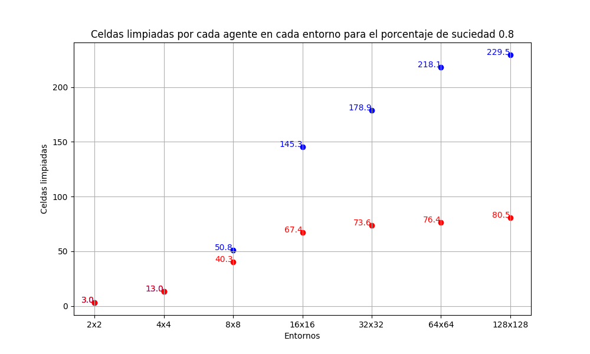
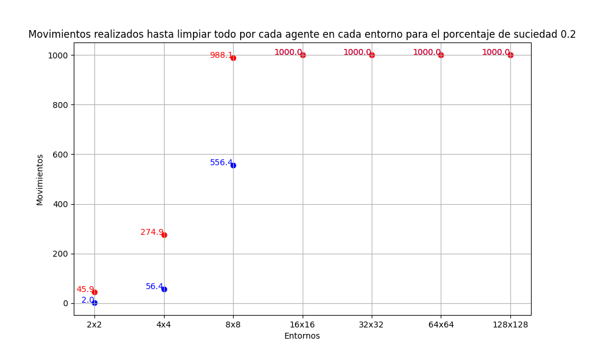
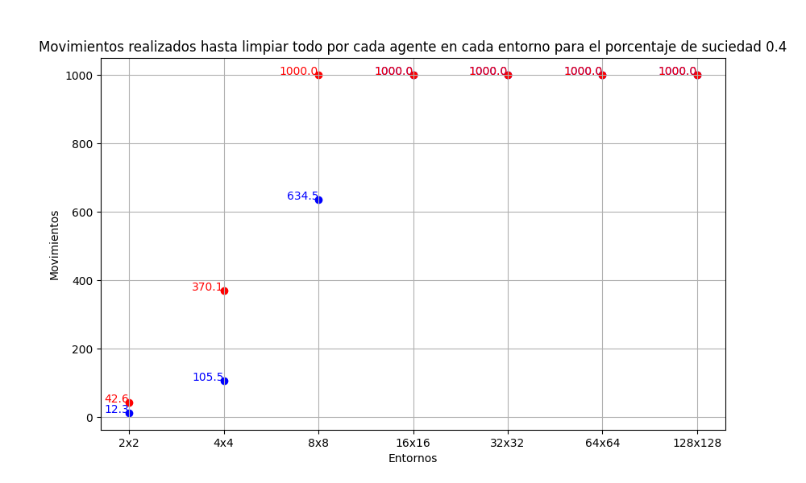
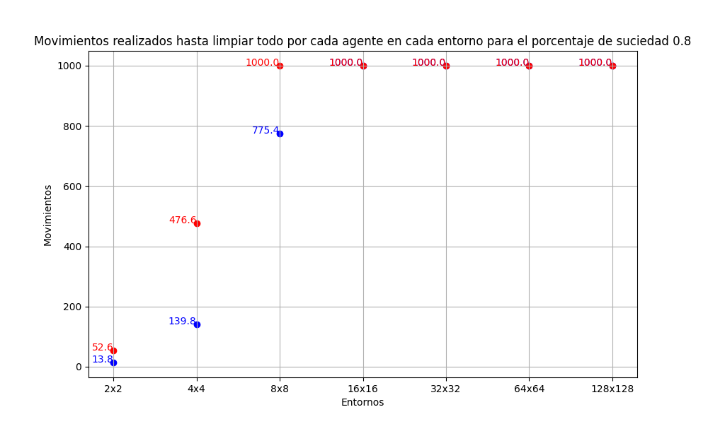

# Reporte de los ejercicios 4 y 5.

## Introducción.  

En los ejercicios **4** y **5** se evaluó un agente reflexivo simple y un agente aleatorio considerando la medida de desempeño y las unidades de tiempo consumidas para entornos de diversos tamaños y diferentes porcentajes de suciedad. Los tamaños de entorno considerados fueron de:
- 2x2, 4x4, 8x8, 16x16, 32x32, 64x64, 128x128
Mientras que los porcentajes de suciedad considerados fueron de:
- 0.1, 0.2, 0.4, 0.8

La evaluación se realizó 10 veces para cada combinación posible y en cada una de estas combinaciones los dos tipos de agente realizaron las pruebas utilizando las mismas distribuciones. 

## Marco teórico.
Para la realización de los ejercicios se utilizaron entornos con el mismo funcionamiento, pero diferentes tamaños y porcentajes de suciedad. Estos entornos tienen las siguientes características:
- La distribución de las casillas sucias no es conocida.
- La localización inicial del agente no es conocida.
- La dimensión del entorno es especificada anteriormente.
- No se genera nueva suciedad posterior a la inicial.

Además, se utilizaron dos tipos de agente: el agente reflexivo simple y el agente aleatorio. La diferencia radica principalmente en que el aleatorio realizará en cada turno una acción de manera impredecible mientras que el agente reflexivo simple antes de realizar cualquier acción podrá utilizar su "sensor" para verificar si la casilla actual está limpia o sucia con el objetivo de determinar si succiona o se mueve. Algunas características comunes de ambos agentes son:
- Pueden moverse únicamente en las 4 direcciones (Arriba, abajo, izquierda, derecha) si no se salen de la grilla.
- Pueden no hacer nada
- Pueden aspirar (limpiar la casilla)
- Tienen un tiempo de vida de 1000 acciones
- El agente puede percibir la locación para saber si contiene suciedad.

## Diseño experimental.
Los experimentos realizados consistían en poner a prueba a los dos agentes en diferentes entornos con diferentes porcentajes de suciedad. Los tamaños de los ambientes fueron de: 2x2, 4x4, 8x8, 16x16, 32x32, 64x64 y 128x128 mientras que los porcentajes de suciedad fueron de 0.1, 0.2, 0.4 y 0.8. Finalmente, los entornos utilizados fueron todas las combinaciones posibles entre las diferentes dimensiones y los porcentajes de suciedad. Ambos agentes fueron puestos a prueba en cada combinación un total de 10 veces y ambos con la misma distribución.

La medida de desempeño utilizada fue la cantidad de celdas limpiadas por cada agente. Además, para mejorar y ampliar este análisis, se conservó la cantidad de movimientos que le llevó a cada agente realizar la limpieza.

Los experimentos se realizaron en el lenguaje de programación Python. Para ello, se crearon las clases que representan al entorno y a los dos agentes. Posteriormente, se crearon todos los entornos correspondientes a las combinaciones antes mencionadas junto a sus respectivas copias. Esto es debido a que ambos agentes debieron desempeñarse en exactamente los mismos entornos en cada iteración con el objetivo de poder realizar una justa comparación. Finalmente, se colocaron los agentes en los diferentes entornos, se almacenaron los resultados en un archivo excel y se realizaron gráficos con estos.

## Análisis y discusión de resultados.

Los resultados del experimento fueron almacenados en un archivo excel, al cual es posible acceder a través del siguiente enlace [Excel](https://github.com/TomasRandoM/ia-uncuyo-2024/blob/main/tp2-agentes-racionales/images/results.xlsx). Además, se realizaron diferentes gráficos para ilustrar los resultados obtenidos. Estos fueron realizados utilizando el promedio de las 10 ejecuciones de cada combinación.

Los primeros gráficos realizados nos muestran la cantidad de celdas que limpió cada agente en cada entorno. Cada gráfico corresponde a un porcentaje de suciedad distinto. En ellos, los puntos de color rojo corresponden a los resultados del agente aleatorio mientras que los puntos de color azul corresponden a los del agente reflexivo simple.

Teniendo estos gráficos en cuenta, se puede observar que a partir del entorno de tamaño 8x8 comienza a haber una diferencia en la cantidad de celdas limpiadas por cada agente. Además, a medida que el entorno crece, esta diferencia comienza a ser cada vez más significativa. Hasta aquí ya podemos concluir que el agente reflexivo simple es significativamente mejor que el agente aleatorio.

Los siguientes gráficos que se realizaron muestran la cantidad de movimientos que realizó cada agente hasta limpiar toda la suciedad del entorno. En el caso de que no se haya conseguido aspirar la totalidad de basura del entorno, el agente habría realizado una cantidad de movimientos igual al total de su vida útil (1000 movimientos). Nuevamente, los resultados obtenidos por el agente aleatorio se muestran en color rojo, mientras que los del agente reflexivo simple se muestran en color azul.

Es posible observar que a partir del entorno 8x8 para porcentajes de suciedad altos el agente aleatorio no es capaz de limpiar la totalidad de celdas. Además, podemos observar que para dimensiones menores, la cantidad de tiempo que le lleva limpiar todas las celdas sucias es mucho mayor que la cantidad del agente reflexivo simple. Otra observación que es posible realizar es que a partir del entorno de tamaño 16x16 el agente reflexivo simple tampoco es capaz de limpiar la totalidad del entorno. Estos gráficos apoyan los resultados derivados de los anteriores, es decir, el agente aleatorio es bastante inferior a su oponente, tanto en la cantidad de celdas que logra limpiar como en la cantidad de movimientos que realiza para hacerlo.

## Conclusión.

Se concluye a partir de los resultados obtenidos anteriormente que el agente reflexivo simple es ampliamente superior al agente aleatorio, esto era de esperarse, pues el segundo no tiene la capacidad de "ahorrar movimientos" al no poder limpiar solo si la casilla está sucia. 