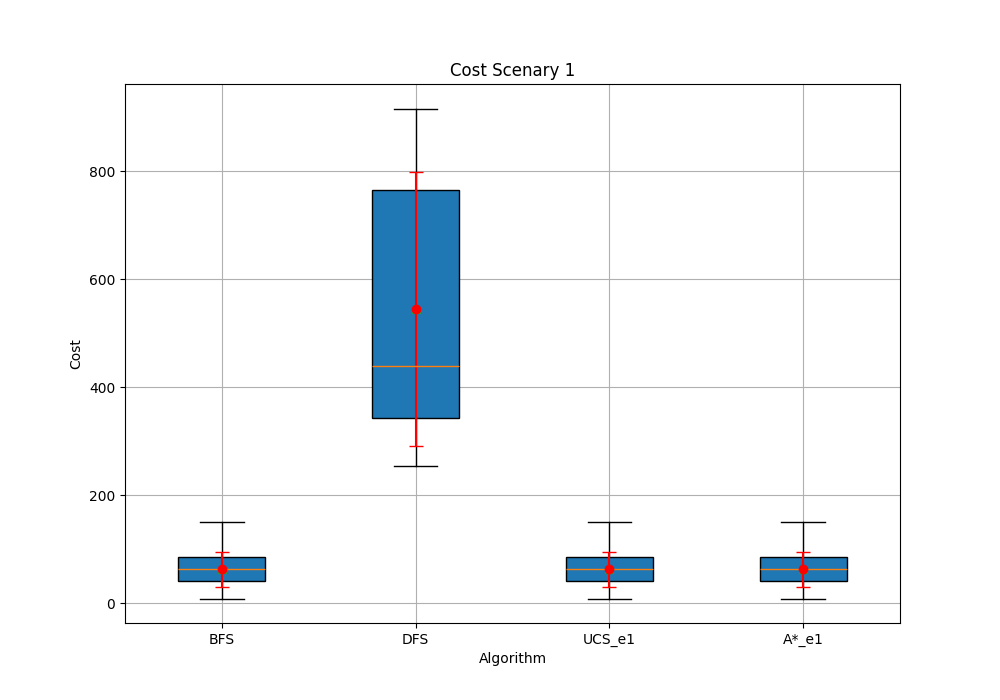
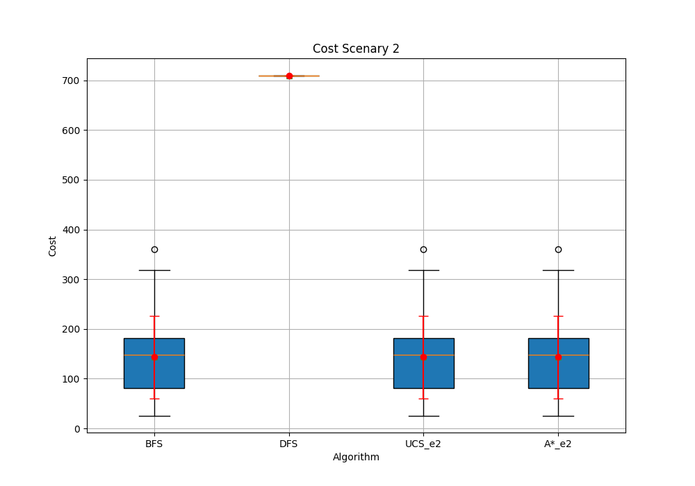
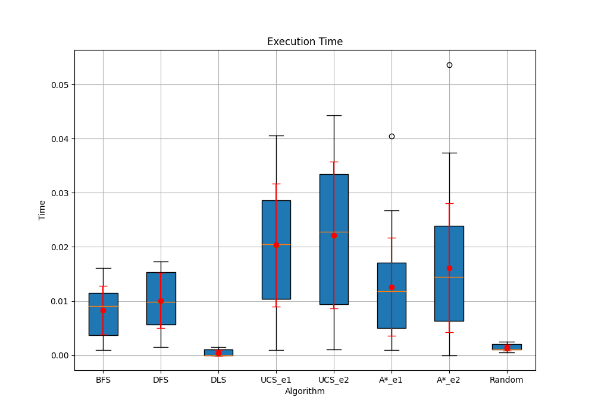
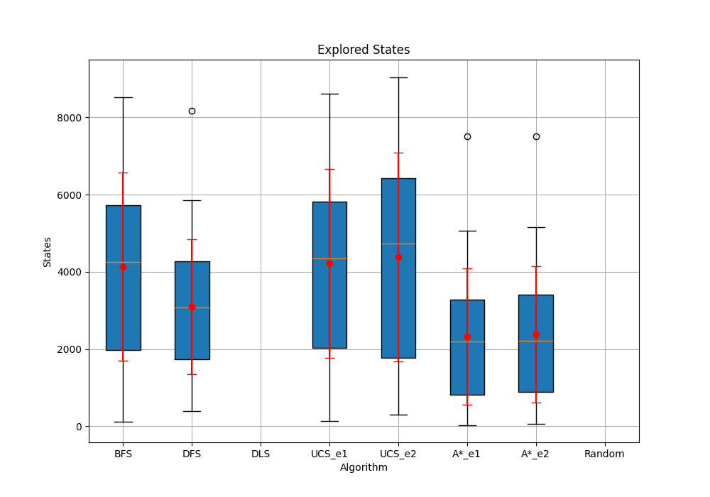
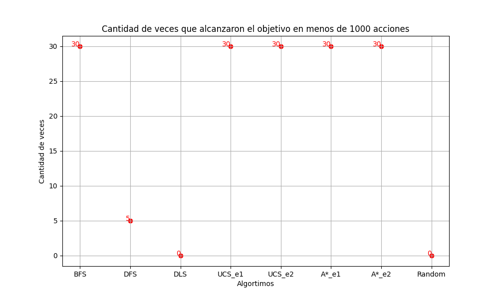

# Reporte TP3 y TP 4

## Introducción:  
Se realizaron los algoritmos correspondientes a la búsqueda no informada, es decir:
- BFS
- DFS
- DLS
- UCS   

Y uno correspondiente a la búsqueda informada:
- A*  

Todos los algoritmos se probaron utilizando el entorno FrozenLake teniendo en cuenta dos costos diferentes:   
- Costo de cada acción: 1.
- Costo de cada acción: La correspondiente a su número identificador + 1. 

## Marco teórico

El entorno que se utilizó para la realización de los algoritmos es el FrozenLake-v1 de la librería Gymnasium disponible en el lenguaje de programación Python. Se trata de una cuadrícula de tamaño n x n que representa un lago congelado. En el lago existen agujeros, los cuales representan los obstáculos para el agente. Además, en una posición aleatoria del entorno se coloca un agente y un objetivo. Para ello, se creó una función personalizada que tomaba como argumento la probabilidad de que una casilla sea de hielo.

Con respecto al agente, puede moverse en las 4 direcciones, izquierda, abajo, derecha y arriba. Cada una de estas se representa con un número (0 a 4, respectivamente). Además, la propiedad "is_slippery" del entorno fue deshabilitada para que las acciones se realicen correctamente. El objetivo de este es llegar correctamente al objetivo, colocado en una posición aleatoria del entorno. 

Por último, para cada algoritmo (y entorno, en consecuencia) se establecieron dos escenarios diferentes. En el primero, el coste de los movimientos del agente es siempre 1, en cambio en el segundo el coste es el valor que identifica la acción + 1.

## Diseño experimental  

Los experimentos consistieron en ejecutar los algoritmos para 30 entornos diferentes, generados aleatoriamente utilizando la semilla "TP3" de la biblioteca random de Python. Todos los algoritmos fueron realizados utilizando el lenguaje de programación Python en su versión 3.0.

El primer algoritmo realizado fue el **BFS** o **Búsqueda en anchura**. Este algoritmo lo que hace es partir desde el punto inicial e ir expandiendo primero los nodos frontera a este. 

El siguiente fue el **DFS** o **Búsqueda en profundidad**, él cual partiendo desde el punto inicial, expande los nodos priorizando siempre el de la izquierda.

Luego, se realizó el **DLS** o **Búsqueda en profundidad limitada**, este es muy similar al DFS, pero la profundidad se limita a un valor particular. Para el presente experimento se tomó un límite de **10**.

Posteriormente, se desarrolló el **UCS** o **Búsqueda de costo uniforme**. En este algoritmo básicamente se prioriza los nodos que tienen menor costo. Para este experimento, se realizó dos veces, cada una tomando un valor de costo diferente, correspondiente a los escenarios 1 y 2. 

El último algoritmo desarrollado fue el **A***. Es un algoritmo muy similar al UCS, sin embargo, se utiliza una heurística para calcular el costo de los nodos. Para el presente TP se utilizaron dos heurísticas, una para cada escenario:  

- La primera, realizada para el primer escenario, fue la heurística basada en la distancia Manhattan.
- La segunda, realizada para el segundo escenario, fue hecha con la distancia Manhattan, pero se le agrega el costo de realizar la acción (Sin aumentarla en 1).   

## Análisis y discusión de resultados

Para todas las ejecuciones de todos los algoritmos en los 30 entornos se recopilaron las medias, medianas y desviaciones estándar, con los cuales se realizaron diagramas de cajas y extensiones. Además, se realizó un gráfico adicional que muestra la cantidad de veces que un algoritmo encontró una solución en los entornos en los que se ejecutó. 

### Diagrama de cajas y extensiones: Costos con escenario 1
Para la realización de este diagrama, NO se tuvieron en cuenta los algoritmos que tuvieron costos mayores a 1000 o que no fueron hechos basados en el escenario 1 (UCS_e2 y A*_e2). En el caso de que no aparezca el algoritmo es porque no se encontró solución con él.  

Con este gráfico podemos observar que para los algoritmos: BFS, A* y UCS se encuentran caminos que no superan aproximadamente 180 de costo, mientras que el DFS encuentra caminos que llegan a los 900 de costo. Además, se puede observar o deducir como el DLS o el Random no encuentran solución en menos de 1000 pasos. De esto, podemos concluir una aparente inferioridad del algoritmo de búsqueda en profundidad, del profundidad limitada y del aleatorio. Por último, podemos observar que los 3 mejores podrían estar encontrando el mismo camino o diferentes, pero con el mismo costo.

### Diagrama de cajas y extensiones: Costos con escenario 2
Para la realización de este diagrama, nuevamente, no se tuvieron en cuenta los algoritmos que tuvieron costos mayores a 1000 o que no fueran hechos para el escenario 2 (UCS_e1 y A*_e1).

En este diagrama, nuevamente vemos que no se obtuvo una solución o tuvo un costo mayor a 1000 para los algoritmos DLS, Random. Además, podemos ver que el DFS tuvo menos soluciones con costo menor a 1000, comparándolas con las que tuvo en el escenario 1. Para el resto de los algoritmos (BFS, A*, UCS) se obtuvieron soluciones de mayor costo que las obtenidas para el escenario 1, pero, nuevamente todas tuvieron los mismos costos, por lo que se puede observar nuevamente que existe la posibilidad de que se hayan encontrado los mismos caminos.  

### Diagrama de cajas y extensiones: Tiempos de ejecución 
Para este diagrama, se tuvieron en cuenta todas las ejecuciones, hayan llegado al resultado o no. En el diagrama se muestra el tiempo total en segundos que demoró cada ejecución de cada algoritmo. 

En el diagrama podemos observar una clara superioridad del DLS y del Random, los cuales poseen un tiempo de ejecución cercano a los 0 segundos. Esto era de esperar, pues el DLS no puede explorar nodos más allá de una profundidad específica y el random, además de poseer una implementación más sencilla, posee un límite de 1000 de vida. Los siguientes algoritmos más rápidos son el BFS y el DFS, lo cual, nuevamente tiene sentido ya que tienen una implementación mucho más sencilla al no tener que utilizar colas de prioridad. El siguiente algoritmo más raṕido es el A* y el más lento es el UCS. Además, con respecto a la variabilidad, podemos ver que los tiempos de ejecución de los UCS y A* fueron mucho más variables que los de los otros algoritmos. 

Teniendo esto en cuenta, en términos de tiempo de ejecución, podemos ver una superioridad del DLS Y el random, sin embargo, teniendo en cuenta que no encontraron soluciones o encontraron con costo mayor al máximo permitido, no podemos concluir que sean los mejores algoritmos. Entre los 3 que encontraron mejores soluciones (BFS, UCS y A*) podemos ver que el orden de velocidad es: BFS, A* y UCS*.

Por último, se recuerda que esta métrica está muy ligada a la implementación realizada, por lo que podrían variar con las de otras realizadas. 

### Diagrama de cajas y extensiones: Estados explorados hasta encontrar una solución.
En este diagrama se muestra la cantidad de nodos (o estados) que el agente exploró hasta encontrar una solución. Para este gráfico no se tuvieron en cuenta los que no lograron llegar al objetivo.   
   

En este gráfico podemos observar que los algoritmos que más estados exploraron fueron el UCS, el BFS y el DFS, en ese orden, mientras que el que menos estados exploró fue el A*. Además, se puede identificar una mayor variabilidad de los datos por parte del BFS y del UCS, mientras que el DFS y el A* parecería tener una menor variabilidad, con excepción de algún dato anómalo. Con respecto al Random y al DLS, nuevamente se puede observar que no encontraron una solución.   

En esta sección podemos ver una clara superioridad del A* y del DFS, sin embargo, si tenemos en cuenta los otros gráficos, no se puede concluir que el DFS sea mejor, pues sus soluciones tenían costos demasiados elevados, mientras que las del A* parecerían ser las mejores.

### Gráfico: Cantidad de veces que el algoritmo encontró una solución en menos de 1000 acciones.

Este gráfico muestra solamente la cantidad de veces que un algoritmo encontró una solución cuando fue ejecutado en los 30 entornos con un costo menor o igual a 1000 acciones. Para hacerlo, se tuvo en cuenta solamente el escenario 1.

  

Podemos observar que los algoritmos que siempre encontraron una solución fueron el BFS, el UCS y el A*. Sin embargo, el random y el DLS nunca lograron llegar al objetivo en menos de 1000 acciones y el DFS solamente lo pudo hacer 5 veces. Este gráfico si denota una clara superioridad de los 3 primeros algoritmos, un rendimiento medio-bajo del DFS y un rendimiento nulo del random y el DLS.

## Conclusiones
De todos los gráficos obtenidos podemos concluir que existe una superioridad de 3 algoritmos: El BFS, el UCS y el A*. Sin embargo, el BFS y el A* son más rápidos que el UCS y a su vez el A* explora menos estados que los otros dos. 

Personalmente, opino que la diferencia en tiempo de ejecución es mínima (aproximadamente unos 0.03 segundos), por lo que creo que el mejor algoritmo es el A* por la gran diferencia que existe en la gran cantidad de estados explorados. Sin embargo, el BFS también podría ser una buena opción a considerar.