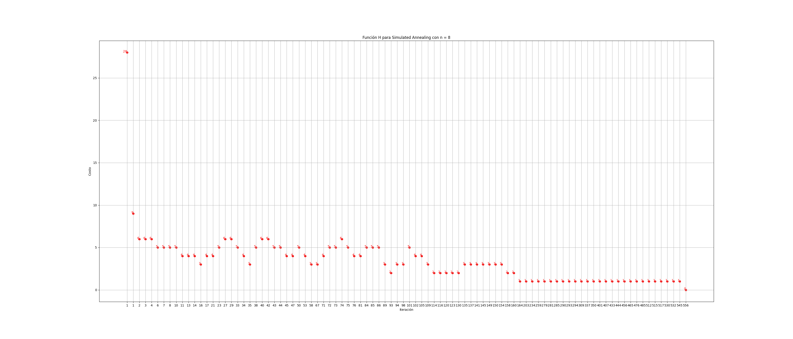
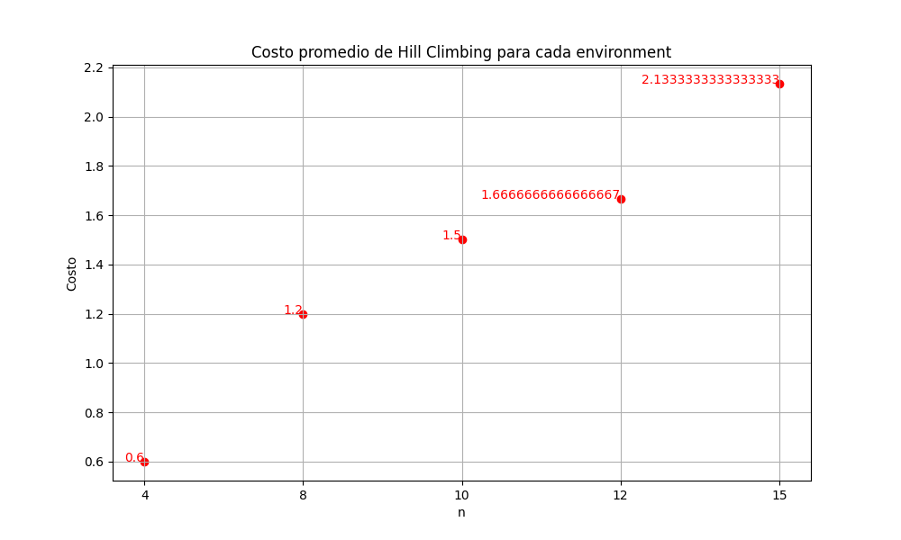
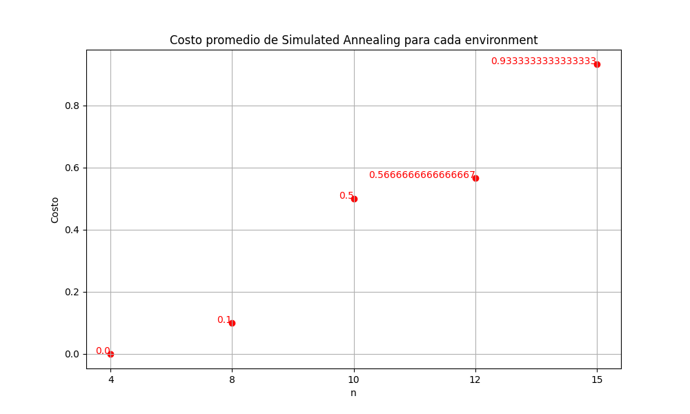
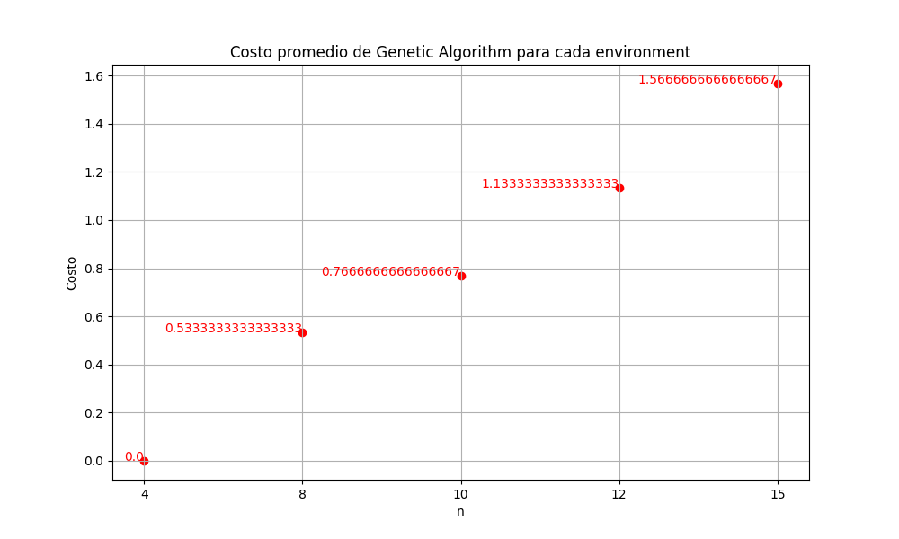
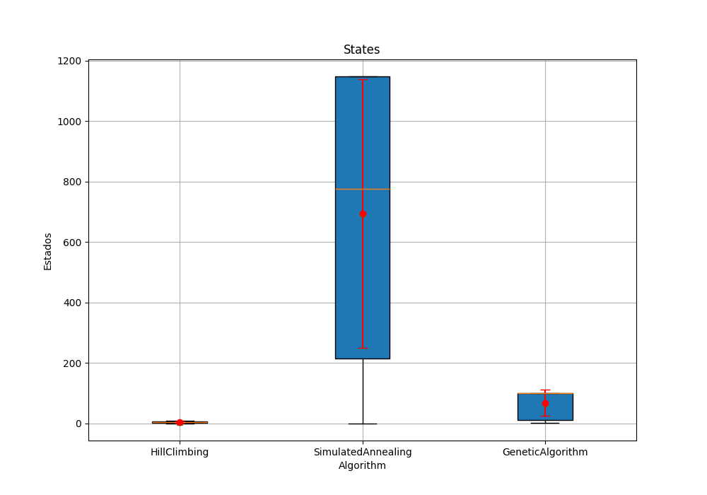

# Reporte TP 5

## Introducción:  
Se realizaron los algoritmos correspondientes a la búsqueda local para resolver el problema de las N reinas. Se implementaron los siguientes:  
- Hill Climbing
- Simulated Annealing
- Genetic Algorithm  

Todos los algoritmos se probaron utilizando un entorno de n x n, siendo n = 4, 8, 10, 12, 15 en el lenguaje de programación Python.  

## Marco teórico

El entorno utilizado para la realización de los algoritmos fue un tablero de n x n elaborado en el lenguaje de programación Python. Para ello, se utilizaron diversos valores de n, estos fueron: 4, 8, 10, 12 y 15. El tablero fue representado utilizando una lista en la que cada posición era una columna y cada valor en esa posición era la fila en donde se encontraba la reina. Al inicio, en cada columna se colocó una reina en una posición aleatoria dada por la semilla "TP5".  

Con respecto al primer algoritmo, Hill Climbing, se comienza con la solución aleatoria generada y se generan soluciones vecinas, es decir, soluciones en las que se mueve una reina de una columna. Posteriormente, el algoritmo explora esas soluciones vecinas y se queda con la que posee mejor función objetivo, es decir, la menor, ya que como h se tomó en cuenta la cantidad de pares de reinas amenazadas entre sí.  

El segundo algoritmo, Simulated Annealing, es muy parecido a Hill Climbing pero se agrega la posibilidad de que cuando una solución encontrada sea peor a la actual, se acepta con cierto grado de probabilidad.  

Con respecto al algoritmo genético, se crea una población, es decir, un conjunto de soluciones posibles. Luego, se va actualizando la población seleccionando dos padres aleatorios, cruzándolos y aplicando una mutación con cierto grado de probabilidad.

## Diseño experimental  

Los experimentos realizados fueron hechos en el lenguaje de programación Python. Para ello, se creó el entorno en el que se realizaron los experimentos utilizando la librería random con la semilla "TP5". Se crearon entornos de tamaño 4, 8, 10, 12 y 15. Además, para cada uno de estos cada algoritmo se ejecutó 30 veces.

Para el primer algoritmo, Hill Climbing, se colocó un límite de 5000 iteraciones. Además, otras condiciones de parada adicionales fueron que la función objetivo fuera 0 o que la solución encontrada fuese peor que la solución anterior.

Con respecto a Simulated Annealing, nuevamente se colocó un límite de 5000 iteraciones y se mantuvo la condición de que se detuviera cuando encontrara una solución con función objetivo igual a 0. Adicionalmente, se agregó la condición que se detuviese cuando la temperatura fuese menor a 0.00001, con una función de enfriamiento T * 0.99

Para el último algoritmo, el genético, se eligieron dos soluciones padres utilizando la selección por torneo con una cantidad k igual a 10. Posteriormente, esos padres se cruzaron utilizando un cruzamiento por un punto y se aplicó una mutación con una probabilidad de 0.1. Con respecto al tamaño de la población y al límite de generaciones ambas fueron de 100.

## Análisis y discusión de resultados

### Gráfico: Tiempo de ejecución

Se realizó el gráfico de cajas con los tiempos de ejecución de los 3 algoritmos.

Es posible observar que para Hill Climbing y Simulated Annealing los tiempos de ejecución son muy pequeños, siempre cercanos a 0. Por el contrario, para el algoritmo genético, los tiempos de ejecución tienen bastante variabilidad, pues algunos van desde casi los 0 segundos mientras que otros llegan a los 3.5 segundos aproximadamente.

### Gráfico: Función H en función de las iteraciones

Los gráficos muestran los cambios en los valores de h en las iteraciones correspondientes para los 3 algoritmos.  

En estos gráficos es posible observar que Hill Climbing, al contrario que los otros dos, no llega al mínimo global, sin embargo, la cantidad de iteraciones realizadas es mucho mejor. Por el contrario, Simulated Annealing y el algoritmo genético encuentran el mínimo 0, pero lo hacen en muchas más iteraciones. Además, es importante destacar que el genético encontró la solución en más iteraciones que el segundo.

### Gráfico: Costo promedio para cada entorno con cada algoritmo.

Se muestran los promedios de los costos de cada algoritmo para cada entorno.

Se observa como para tamaños mayores del entorno, los promedios de los costos también aumentan. Podemos concluir que el Hill Climbing es el peor de los 3 en términos de función objetivo. Por otro lado, Simulated Annealing y el algoritmo genético tienen valores mucho mejores, sin embargo, el genético no supera a su oponente.

### Gráfico: Porcentaje de veces que el algoritmo alcanza el óptimo para cada entorno

El gráfico muestra el porcentaje de veces que cada algoritmo alcanzó el óptimo, es decir, una función objetivo igual a 0 para cada entorno.

Se pueden obtener las mismas conclusiones que con el gráfico anterior. Es decir, Hill Climbing es el peor de los 3, llegando al punto de que para el entorno de tamaño 15 nunca encuentra solución. Además, Simulated Annealing es ligeramente superior al restante.

### Gráfico: Estados recorridos

Se realizó el gráfico teniendo en cuenta la cantidad de estados que los algoritmos recorren hasta encontrar la solución. En el caso del algoritmo genético, se toma en cuenta la cantidad de generaciones recorridas.

Se puede concluir que en términos de estados recorridos, el Simulated Annealing es el peor de todos, pues es el que recorre más estados. Además, en este caso, el Hill Climbing es el mejor, pues recorre la menor cantidad.

## Conclusiones

Se puede concluir que para las configuraciones y parámetros utilizados en los experimentos realizados, el mejor algoritmo es el simulated annealing. Esto es debido a que es el que posee mejor promedio de óptimos encontrados y mejores tiempos de ejecución. Sin embargo, su eficacia disminuye mientras el tamaño del entorno aumenta. Por el contrario, Hill Climbing posee un excelente tiempo de ejecución, pero no encuentra los óptimos con tanta frecuencia. Con respecto al algoritmo genético, con la cantidad de generaciones que se utilizaron y la configuración realizada, no se posee un buen balance entre tiempo de ejecución y óptimos encontrados. Considero que no se justifica tener un tiempo de ejecución tan elevado teniendo un algoritmo como el simulated annealing para resolver el problema de las n reinas.
