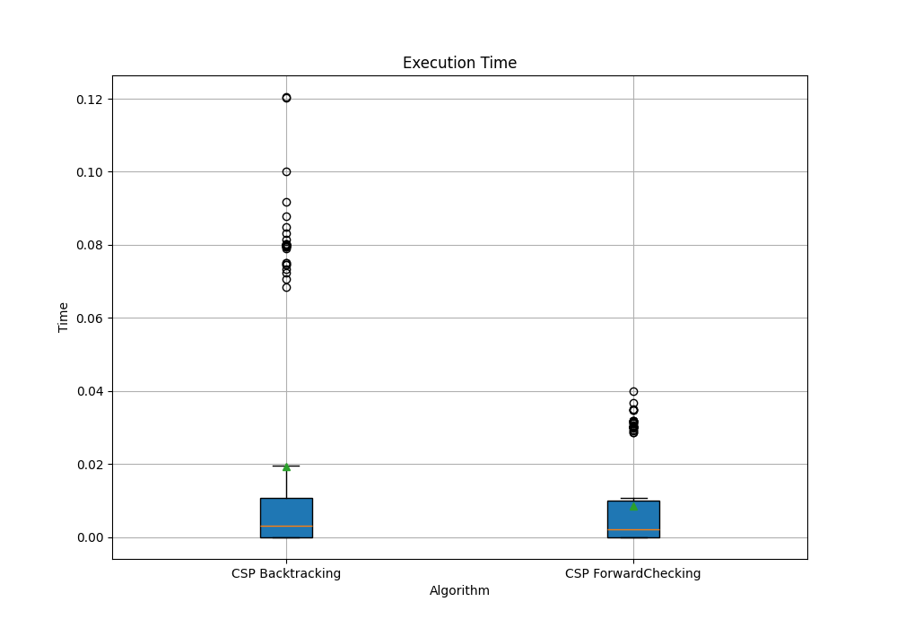

# Reporte del TP6
 **Alumno: Tomás Rando**

### Ejercicio 1.

Se definen los componentes del problema:

- Variables: Las casillas del tablero del sudoku
- Dominio: Números enteros del 1 al 9
- Restricciones: El mismo número no puede encontrarse dos veces en la misma fila, en la misma columna o en el mismo subcuadro de 3x3.

### Ejercicio 2.
R es rojo, B es azul y G es verde.
WA = R
V = B
Se comienza con una lista con todos los arcos (SA-WA, SA-V, NT-WA, NT-SA, Q-SA, Q-NT, NSW-Q, NSW-SA, NSW-V).

Se va iterando removiendo el primer elemento de la lista en cada iteración. Se revisa si los valores del dominio de Xi son consistentes con respecto a los valores del dominio de la otra variable Xj teniendo en cuenta las restricciones existentes. Si hay algún valor en el dominio Xi que no tiene valor correspondiente en el dominio de Y, el valor se elimina del dominio Xi. Si Xi está vacío se retorna falso porque significa que no se tiene solución.

Entonces:  
- SA-WA -> Se elimina R de SA. Se agregan todos los arcos (SA, Vecinos - WA) a la lista.
- SA-V -> Se elimina B de SA. SA queda G. Se agregan todos los arcos (SA, Vecinos - V) a la lista.
- NT-WA -> Se elimina R de NT. Se agregan todos los arcos (NT, Vecinos - WA) a la lista.
- NT-SA -> Se elimina G de NT. NT queda B. Se agregan todos los arcos (NT, Vecinos - WA).
- Q-SA -> Se elimina G de Q. Se agregan todos los arcos (Q, Vecinos - SA).
- Q-NT -> Se elimina B de Q. Q queda R. Se agregan todos los arcos (Q, Vecinos - NT).
- NSW-Q -> Se elimina R de NSW. Se agregan todos los arcos (NSW, Vecinos - Q).
- NSW-SA -> Se elimina G de NSW. Se agregan todos los arcos (NSW, Vecinos - SA)
- NSW-V -> Se elimina B de NSW. El dominio de NSW queda vacío y se retorna falso

### Ejercicio 3

La complejidad en el peor caso cuando se ejecuta AC-3 en un árbol estructurado CSP es de O(Aristas * Tamaño dominio) ya que nunca se vuelven a agregar las aristas para ser revisadas nuevamente.

### Ejercicio 4
Para cada Xi en cada arco (Xi, Xj), se mantiene un contador con la cantidad de valores del dominio de Xi que son consistentes con cada valor del dominio de Xi. Entonces, si un elemento de Xi es eliminado, se debe reducir en 1 el contador para cada (Xk, Xi) donde ese elemento haya estado afectando previamente. Utilizando esta técnica es posible reducir la complejidad temporal a la solicitada.

### Ejercicio 5
a)
Se supone que el csp cuyo grafo de restricciones es un árbol es 2-consistente. Entonces, para cualquier variable Xi y cualquier valor v en el dominio de Xi existe una asignación de valores a Xj que satisfaga las restricciones entre Xi y Xj. Además, gracias a que el grafo de restricciones es un árbol (Entre cualquier par de vértices existe a lo sumo un camino), se puede recorrer eficientemente realizando un topological sort, de manera que se seleccione una raíz (generalmente una hoja) y se ordenen las variables de tal forma que cada variable aparezca después de su padre en el árbol. Por ejemplo:

Otra característica es que los arcos entre padres e hijos son consistentes, esto quiere decir que si elegimos cualquier valor para el padre, existirá algún valor válido para el hijo. Además, se puede realizar de manera que se verifique la consistencia de las restricciones de los hijos antes de llegar a un nodo padre. Teniendo en cuenta esto, para cualquier Xi, al llegar a este nodo, ya se habrá confirmado la consistencia de las restricciones con los hijos. Entonces, todas las restricciones (Xi, Xk) son consistentes. Además, por el orden de verificación de restricciones (hijos, luego padres), al verificar las restricciones con los padres de Xi podemos asegurar que serán consistentes. Finalmente, esto nos indica que para un conjunto de n-1 variables, siempre se puede asignar un valor a la n-ésima variable cumpliendo las restricciones, siendo n-consistente.
b)
Esto es suficiente ya que si logramos que todas las variables sean consistentes, se elimina cualquier inconsistencia y se puede asegurar que existe una asignación que cumple con todas las restricciones del problema. 

### Ejercicio 6 y 7

Se realizaron los dos algoritmos solicitados. Se presentan los gráficos correspondientes.  

En este gráfico se presentan diagramas de cajas y extensiones en donde se ven los tiempos de ejecución de los 2 algoritmos. Para su realización se tuvieron en cuenta todos los tamaños de entorno.

Para el siguiente gráfico nuevamente se tomaron en cuenta todos los tamaños dados. En los diagramas de cajas se muestran las iteraciones que se realizaron hasta llegar al resultado.

El siguiente es un gráfico de dispersión que nos muestra el porcentaje de veces que el algoritmo de CSP con Backtracking encontró el resultado óptimo para cada tamaño de entorno.

Se realizó el mismo gráfico pero para el algoritmo CSP con Forward Checking.

Los datos presentados en los últimos dos gráficos pueden ser visualizados en la siguiente tabla

Teniendo en cuenta los resultados obtenidos creo que la implementación con Forward Checking es superior en todo sentido. Es decir, es más rápida y reduce enormemente la cantidad de iteraciones realizadas para llegar a la solución. Además, todavía sería posible de mejorar si se implementara junto a alguna heurística (Por ejemplo empezar desde la fila con más restricciones) ya que por el momento no se implementó con ninguna.
