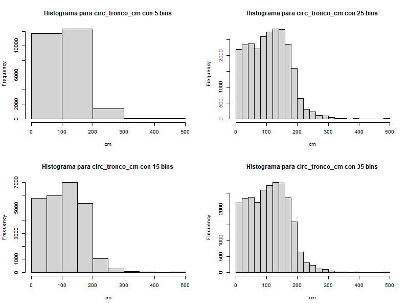

##### Alumno: Tomás Rando

###### 2) A partir del archivo arbolado-mendoza-dataset-train.csv responder las siguientes preguntas:
a) Cual es la distribución de las clase inclinacion_peligrosa?  

b) ¿Se puede considerar alguna sección más peligrosa que otra?  

c) ¿Se puede considerar alguna especie más peligrosa que otra?  

- a) La mayor parte de los árboles no tiene inclinación peligrosa. Además, se puede observar que la diferencia es muy marcada.
  

- b)  Sí, se pueden considerar algunas secciones más peligrosas, por ejemplo la 4 sección o la 5ta.
  

- c) Nuevamente, sí es posible considerar algunas especies más peligrosas que otras, especialmente la Morera.

###### 3) A partir del archivo arbolado-mendoza-dataset-train.csv
b) Generar un histograma de frecuencia para la variable circ_tronco_cm. Probar con diferentes  números de bins.   

c) Repetir el punto b) pero separando por la clase de la variable inclinación_peligrosa

Los criterios de corte seleccionados fueron 85, 175 y 255.