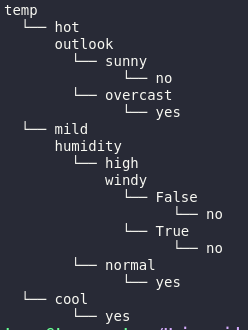

##### Alumno: Tomás Rando

###### A). Resultados sobre la evaluación sobre tennis.csv

###### B). Información sobre las estrategias para datos de tipo real

Con respecto a las estrategias para datos de tipo real, existen diversas maneras de abordarlos. Una de ellas es una de las extensiones del ID3, el algoritmo C4.5. Este fue desarrollado por Ross Quinlan y nos permite manejar atributos continuos. Este algoritmo posee muchas mejoras con respecto al id3, entre ellas:  

- Permite que se maneje atributos continuos y discretos. Crea un umbral y divide la lista entre aquellos cuyo valor es superior y los que poseen un valor inferior o igual.
- Permite manejar los valores de atributo faltantes
- Manejo de atributos con costos diferentes
- Finalizada la creación, realiza la poda del árbol, eliminando las ramas que no son de utilidad.   
  

Posteriormente, el creador también desarrolló el C5.0, pero este último con fines comerciales. Sin embargo, este algoritmo tiene mejoras incorporadas con respecto al predecesor:  

- Es más rápido
- Utiliza memoria más eficientemente
- Los árboles de decisión son más pequeños
- Permite ponderar los casos
- Permite eliminar los atributos no útiles.  
  

Otra de las opciones para tratar con los datos de tipo real es el árbol de regresión. Este es un árbol de decisión que puede predecir salidas continuas en lugar de salidas discretas. Para ello, utiliza una nueva medida que permite visualizar cuánto se desvían las predicciones de la variable objetivo, es decir que se utiliza el MSE (Error cuadrático medio). La diferencia entre un árbol de decisión normal y este es que el id3 utilizaba la entropía, mientras que el árbol de regresión busca la reducción del MSE.  
